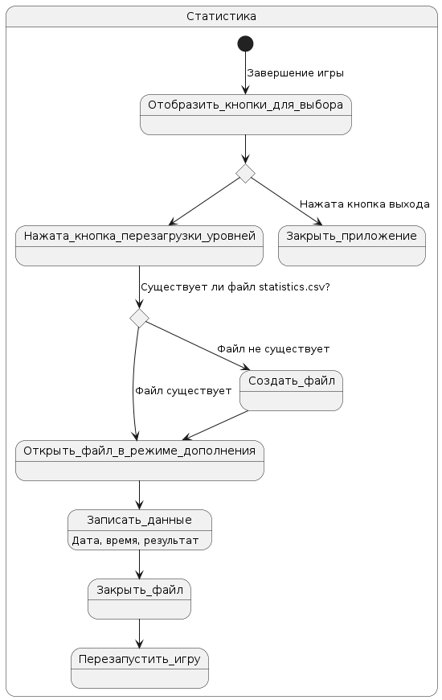
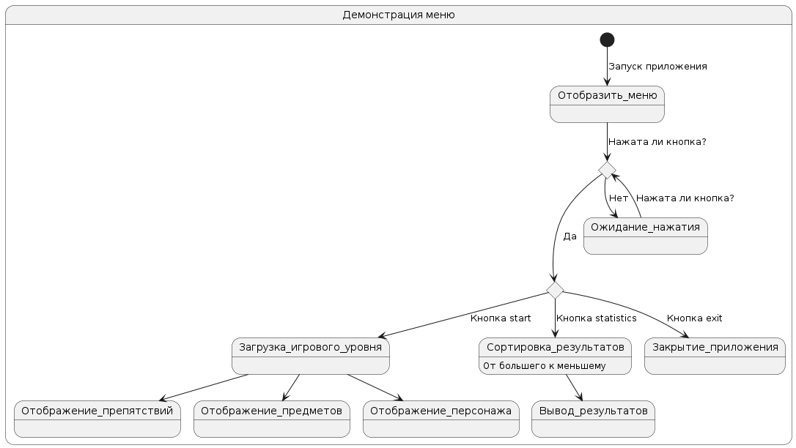
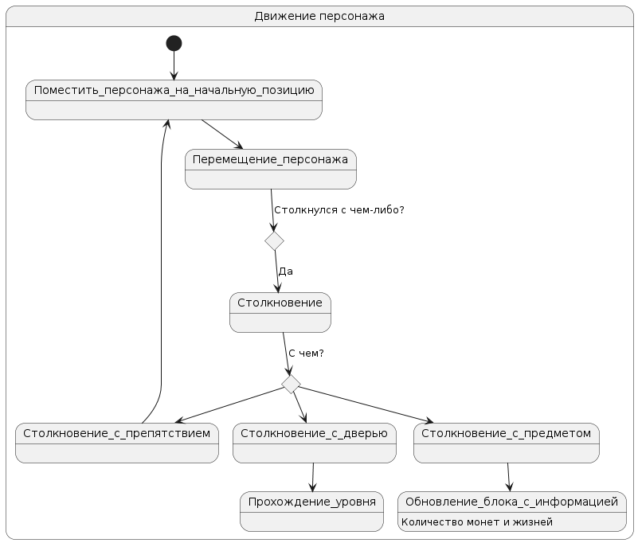
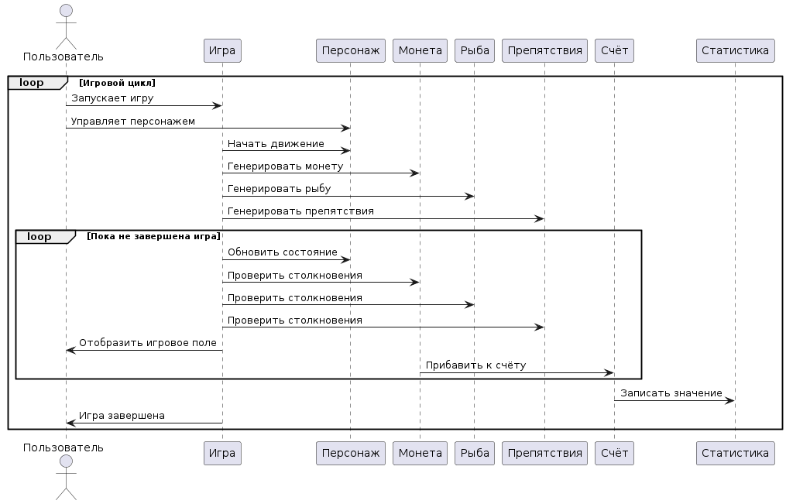

# Поведенческие модели

## Диаграммы состояний
### Диаграмма статистики
* [Оффлайн файл](diagrams/state_diagram_statistics.puml)

__Описание__
При прохождении всех уровней игры пользователь может просто выйти из игры и не сохранить результат, а может перезагрузить игру и результат прохождения автоматически сохранится в в файл statistic.csv.
Если файл statistic.csv не существует, то приложение создаст его и запишет результат.

### Диаграмма меню
 * [Оффлайн файл](diagrams/state_diagram_menu.puml)

__Описание__
Диаграмма состояний описывает процесс демонстрации меню в игровом приложении. При запуске приложения сначала отображается меню. Затем проверяется, была ли нажата какая-либо кнопка. Если кнопка не была нажата, программа продолжает ожидать действия пользователя. Если кнопка была нажата, происходит выбор кнопки: если это кнопка "start", то происходит загрузка игрового уровня с отображением препятствий, предметов и персонажа. Если это кнопка "statistics", то результаты сортируются от большего к меньшему и выводятся. Если же нажата кнопка "exit", приложение закрывается.

### Диаграмма движения персонажа
 * [Оффлайн файл](diagrams/state_diagram_player.puml)

__Описание__
Диаграмма описывает процесс движения персонажа. При запуске игры персонаж помещается на начальную позицию, после чего начинается его перемещение. В процессе перемещения проверяется, столкнулся ли персонаж с каким-либо объектом. Если столкновение произошло с предметом - происходит обновление информации о количестве монет или жизней. При столкновении с препятствием - возвращение персонажа на начальную позицию. Прохождение уровня происходит при столкновении с дверью.

## Диаграмма последовательности
* [Оффлайн файл](diagrams/sequence_diagram.puml)

__Описание__
Эта диаграмма последовательности иллюстрирует процесс обновления состояния игры.

Игра начинается с инициализации, включая установку начального состояния, загрузку игровых объектов и отображение начального экрана.
Пользователь, управляют игровым персонажем при помощи клавиатуры.

Игра ожидает ввода пользователя(нажатие клавиш для движения).
При столкновении персонажа с игровыми объектами происходит обновление состояния игры.

После получения ввода пользователя, игра обновляет состояние в соответствии с действиями пользователя и текущим состоянием игрового мира.

После обновления состояния игры, происходит отображение всех изменений на экране, включая новое положение персонажа и расположение объектов.

Если условия завершения игры выполнены (прохождение последнего уровня), игра завершается, и пользователю предоставляется информация о результате игры.
Счёт игры записывается в таблицу результатов.