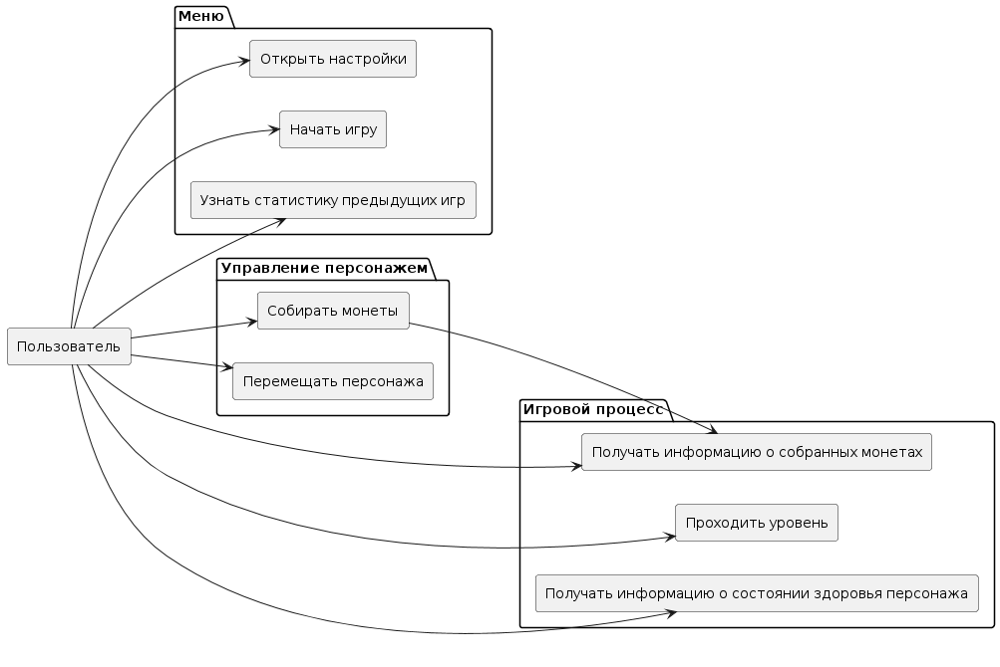
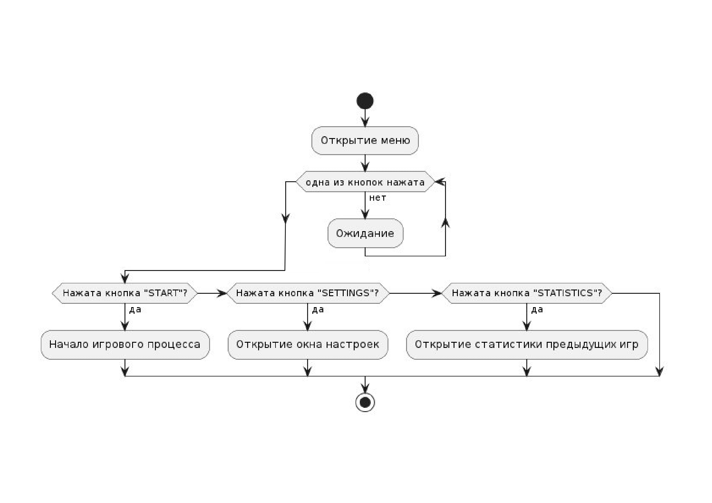

# Функциональные модели 
## Диаграмма вариантов использования
* [Оффлайн файл](use_cases.puml)

## Демнострация меню
- Пользователь открывает приложение.
- Приложение отображает меню игры.
- Пользователь нажимает на одну из нескольких кнопок.
- Приложение обрабатывает сценарий в зависимости от нажатой кнопки.

* [Оффлайн файл](menu.puml)

