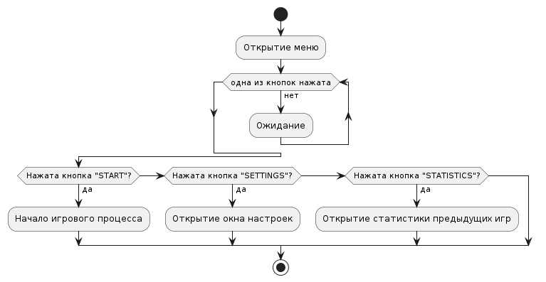
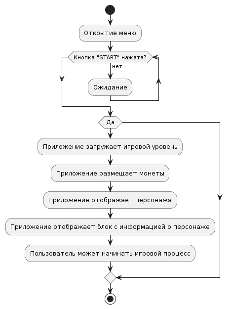
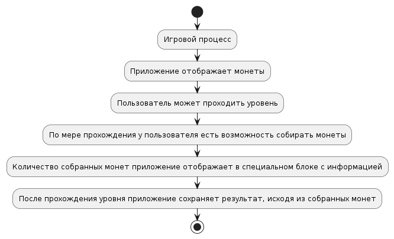
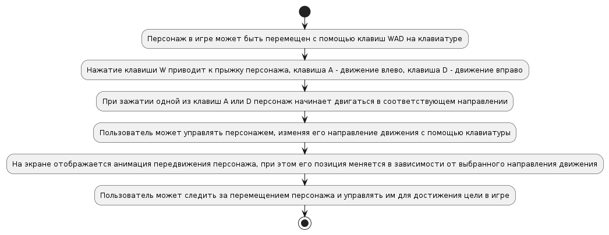

# Функциональные модели 
## Диаграмма вариантов использования
* [Оффлайн файл](use_cases.puml)

## Демонстрация меню
- Пользователь открывает приложение.
- Приложение отображает меню игры.
- Пользователь нажимает на одну из нескольких кнопок.
- Приложение обрабатывает сценарий в зависимости от нажатой кнопки.

* [Оффлайн файл](menu.puml)

## Открыть настройки:
- Пользователь нажимает кнопку settings.
- Приложение отображает настройки.

## Начать игру:
- Пользователь нажимает на кнопку "start" в меню.
- Приложение загружает игровой уровень.
- Приложение размещает монеты.
- Приложение отображает персонажа.
- Приложение отображает блок с информацией о персонаже.
- Пользователь может начинать игровой процесс.

* [Оффлайн файл](start.puml)

## Узнать статистику предыдущих игр:
- Пользователь нажимает кнопку statistics.
- Приложение отображает статистику, состоящую из результатов предыдущих игр.

## Собирать монеты:
- Приложение отображает монеты.
- Пользователь может проходить уровень.
- По мере прохождения у пользователя есть возможность собирать монеты.
- Количество собранных монет приложение отображает в специальном блоке с информацией.
- После прохождения уровня приложение сохраняет результат, исходя из собранных монет.

* [Оффлайн файл](collectcoins.puml)

## Перемещать персонажа:
- Персонаж в игре может быть перемещен с помощью клавиш WAD на клавиатуре.
- Нажатие клавиш W приводит к прыжку персонажа, клавиша A - влево, клавиша D - вправо. 
- При зажатии одной из клавиш A или D персонаж начинает двигаться в соответствующем направлении.
- Пользователь может управлять персонажем, изменяя его направление движения с помощью клавиатуры.
- На экране отображается анимация передвижения персонажа, при этом его позиция меняется в зависимости от выбранного направления движения. 
- Пользователь может следить за перемещением персонажа и управлять им для достижения цели в игре.

* [Оффлайн файл](movement.puml)

## Получать информацию о состоянии персонажа:
- Приложение отображает блок с информацией о персонаже
- Пользователь видит блок с информацией о персонаже, который отображает текущий уровень и количество монет.
